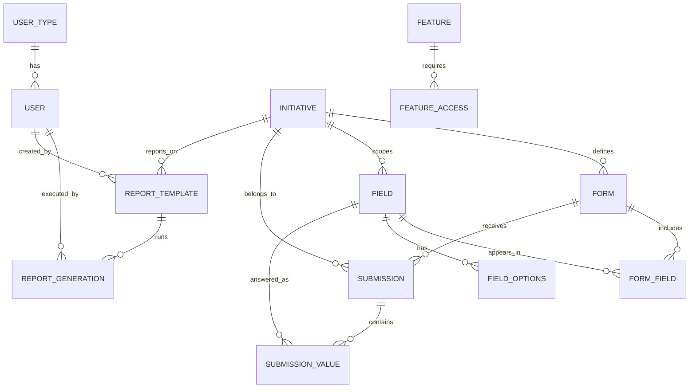

# ASRS Database Design)

This document explains:
- Each table and column (what it stores + why it exists)
- How tables relate (ER + relationship walkthrough)
- How core features work end-to-end:
  - **Form creation**
  - **Form submission**
  - **Reporting (templates + generations)**
- Concrete examples (sample records + example queries)

---

## 1) Big Picture

ASRS reporting system supports **dynamic forms** (fields can vary by initiative) while still enabling **fast reporting**.

It does that by separating:
1. **Definitions** (what a field is, what forms look like, what options exist)
2. **Instances** (a specific submission and its answers)
3. **Analytics configs** (report templates describing what to show/filter/group)

---

## 2) Tables (Catalog + Core Data)

### user_type
**Purpose:** Defines account category + access rank for feature gating.

| Column | Type (typical) | Use |
|---|---|---|
| user_type_id (PK) | int/uuid | Primary key |
| type | text | `public`, `staff`, `admin`, etc. |
| access_rank | int | 1–100 (higher = more permissions) |

**Why:** Simple permissions model: features require `min_access_rank`.

---

### user
**Purpose:** Stores users who submit forms, build forms, or run reports.

| Column | Type | Use |
|---|---|---|
| user_id (PK) | int/uuid | Primary key |
| first_name | text | Profile |
| last_name | text | Profile |
| email (unique) | text | Login identity / contact |
| phone_number | text | Optional contact |
| user_type_id (FK) | int/uuid | Links to `user_type` |

**Notes:** If submissions can be anonymous, `submitted_by_user_id` can be NULL in `submission`.

---

### initiative
**Purpose:** Top-level category (up to ~20 initiatives).

| Column | Type | Use |
|---|---|---|
| initiative_id (PK) | int/uuid | Primary key |
| initiative_name (unique) | text | Human-readable label |

---

### field  *(Field Catalog / Field Definitions)*
**Purpose:** Defines every possible question/attribute ASRS can collect.

| Column | Type | Use |
|---|---|---|
| field_id (PK) | int/uuid | Primary key |
| field_key (unique) | text | Stable machine ID (never changes once used) |
| field_label | text | Label users see (can change without breaking storage) |
| field_type | enum/text | `text`, `number`, `date`, `boolean`, `select`, `multiselect`, `rating`, `json` |
| scope | enum/text | `common`, `initiative_specific`, `staff_only` |
| initiative_id (FK, nullable) | int/uuid | NULL if `common`; set if initiative-specific |
| is_filterable | boolean | Can this be used as a report filter? |
| is_required_default | boolean | Default required-ness (can be overridden in a form) |

**Why `field_key` matters:**  
Reports and integrations should use `field_key` (stable), not `field_label` (human editable).

---

### field_options
**Purpose:** Allowed options for `select` and `multiselect` fields.

| Column | Type | Use |
|---|---|---|
| field_option_id (PK) | int/uuid | Primary key |
| field_id (FK) | int/uuid | Which field this option belongs to |
| option_value | text | Stored value (stable) |
| display_label | text | Shown to users |
| display_order | int | UI ordering |

**Example:** Field “Department” might have option_value `it`, `finance`, etc.

---

### form
**Purpose:** A saved form configuration (a “built form”), usually per initiative.

| Column | Type | Use |
|---|---|---|
| form_id (PK) | int/uuid | Primary key |
| initiative_id (FK) | int/uuid | Which initiative this form belongs to |
| form_name | text | Name e.g. “Public Submission Form” |
| created_at | timestamp | Audit |
| updated_at | timestamp | Audit |
| updated_by_user_id (FK) | int/uuid | Who last edited |

**Why forms are separate from initiatives:**  
An initiative can have multiple forms (public vs staff intake, different versions, etc.).

---

### form_field  *(Form Builder Join Table)*
**Purpose:** Determines which fields appear on a given form + in what order + rules.

| Column | Type | Use |
|---|---|---|
| form_field_id (PK) | int/uuid | Primary key |
| form_id (FK) | int/uuid | Which form |
| field_id (FK) | int/uuid | Which field is included |
| display_order | int | UI ordering |
| required | boolean | Overrides `field.is_required_default` |
| is_hidden (optional) | boolean | Hide/show (useful for staff-only forms) |
| help_text (optional) | text | Guidance text |

**Result:** A form is literally “a list of `form_field` rows”.

---

### submission
**Purpose:** Stores a single submitted form instance (one “filled out form”).

| Column | Type | Use |
|---|---|---|
| submission_id (PK) | int/uuid | Primary key |
| initiative_id (FK) | int/uuid | Initiative context |
| form_id (FK) | int/uuid | Which form definition was used |
| submitted_at | timestamp | When submitted |
| submitted_by_user_id (FK, nullable) | int/uuid | Who submitted (NULL if anonymous) |

**Important:** `submission` is the header; answers live in `submission_value`.

---

### submission_value  *(Typed EAV Answers)*
**Purpose:** Stores answers (one row per field answered per submission).

| Column | Type | Use |
|---|---|---|
| submission_value_id (PK) | int/uuid | Primary key |
| submission_id (FK) | int/uuid | Which submission |
| field_id (FK) | int/uuid | Which field |
| value_text | text | For text fields |
| value_number | numeric | For numeric fields |
| value_date | date/timestamp | For date fields |
| value_bool | boolean | For boolean fields |
| value_json | json | For multiselect arrays or complex values |
| *(recommended)* UNIQUE(submission_id, field_id) | constraint | Prevent duplicate answers for same field |

**How types work:**  
- If `field_type = number`, you store in `value_number` and leave others NULL.
- If `multiselect`, store an array in `value_json`, e.g. `["it","finance"]`.

---

### report_template
**Purpose:** Saved reporting configuration (what columns, filters, group-bys, charts).

| Column | Type | Use |
|---|---|---|
| report_template_id (PK) | int/uuid | Primary key |
| initiative_id (FK) | int/uuid | Scope of data |
| template_name | text | Name |
| description | text | Explains what it’s for |
| is_default | boolean | System default template |
| is_public | boolean | Visible to public users |
| created_by_user_id (FK) | int/uuid | Owner/creator |
| created_at | timestamp | Audit |
| updated_at | timestamp | Audit |
| config_json | json | Selected fields, filters, sorts, grouping, charts |
| form_id (FK, optional) | int/uuid | If template is tied to a specific form version |

**Why config_json:**  
Reports change frequently; JSON lets you evolve without schema changes.

---

### report_generation
**Purpose:** Audit + caching layer for report runs (who ran what, when, output reference).

| Column | Type | Use |
|---|---|---|
| report_generation_id (PK) | int/uuid | Primary key |
| report_template_id (FK) | int/uuid | Which template |
| run_by_user_id (FK) | int/uuid | Who ran it |
| run_at | timestamp | When it ran |
| output_ref (optional) | text | Link/key to exported file or cached result |

---

### feature
**Purpose:** List of features that can be gated by access rank.

| Column | Type | Use |
|---|---|---|
| feature_id (PK) | int/uuid | Primary key |
| key (unique) | text | `REPORT_CREATE_DEFAULT`, `FORM_EDIT`, etc. |
| name | text | Friendly name |
| description | text | What it allows |

---

### feature_access
**Purpose:** Minimum access rank required for each feature.

| Column | Type | Use |
|---|---|---|
| feature_access_id (PK) | int/uuid | Primary key |
| feature_id (FK, unique) | int/uuid | Which feature |
| min_access_rank | int | Required rank |

---


## 3) ER Diagram (Mermaid)




---

## 4) How Tables Interact (Core Relationships)

### A) Form Definition Relationships
- `initiative` **has many** `form`
- `form` **has many** `form_field`
- `form_field` points to `field`
- `field` optionally has `field_options`

**In plain English:**  
A form is a curated ordered list of fields.

---

### B) Submission Relationships
- `submission` is a single filled form (header)
- `submission_value` stores each answer
- each `submission_value` references a `field` definition

**In plain English:**  
A submission is a container, and its answers are rows linked by field_id.

---

### C) Reporting Relationships
- `report_template` stores *how* to build a report
- `report_generation` records each run

Reports read primarily from:
- `submission` (time, initiative, form)
- `submission_value` (answers)
- `field` (labels/types)
- `field_options` (display labels)

---

## 5) Feature Walkthroughs (End-to-End)

## 5.1 Form Creation (Admin/Staff)

### Step 1 — Create/Reuse fields
Admin creates fields in `field`:
- Example fields for “Sustainability Initiative”:
  - `project_title` (text)
  - `estimated_cost` (number)
  - `start_date` (date)
  - `needs_approval` (boolean)
  - `department` (select with options)

If `department` is select, insert into `field_options` for that `field_id`.

### Step 2 — Create a form
Insert into `form`:
- initiative_id = Sustainability
- form_name = “Public Submission Form”
- updated_by_user_id = admin user

### Step 3 — Add fields to the form (form_field)
Insert rows into `form_field`:
- One row per included field
- Set `display_order`
- Override `required` where needed

**Result:** The UI form builder is just editing rows in `form_field`.

---

## 5.2 Form Submission (Public or Staff)

### Step 1 — Create the submission header
Insert into `submission`:
- initiative_id = Sustainability
- form_id = Public Submission Form
- submitted_at = NOW()
- submitted_by_user_id = NULL (if anonymous)

### Step 2 — Store each answer
For each field on the form:
Insert into `submission_value` with the correct typed column.

Example:
- project_title → `value_text="Campus Solar Expansion"`
- estimated_cost → `value_number=250000`
- start_date → `value_date="2026-03-01"`
- needs_approval → `value_bool=true`
- department (select) → `value_text="facilities"` (or `value_json` depending on your approach)

---

## 5.3 Report Creation (Template)

When a user creates a report template:
- Insert into `report_template`
- Store report logic in `config_json`

### Example config_json
```json
{
  "columns": ["project_title", "estimated_cost", "start_date", "department"],
  "filters": [
    {"field_key": "needs_approval", "op": "=", "value": true}
  ],
  "sort": [{"field_key": "estimated_cost", "dir": "desc"}],
  "group_by": ["department"],
  "chart": {"type": "bar", "x": "department", "y": "count"}
}
```

**Note:** `field_key` is best for configs (stable even if labels change).

---

## 5.4 Report Generation (Running a report)

When someone runs a report:
1. Insert into `report_generation` (audit)
2. Query submissions + submission_values using the template config
3. Optionally store export reference in `output_ref`

### Typical read path:
- Filter submissions by `initiative_id` + time window
- Join to submission_value for selected fields
- Map `field_id → field_key/label` via `field`
- Translate select values via `field_options`

---

## 6) Concrete Examples

## 6.1 Example Data (Readable)

### Initiative
- `initiative`: (1, "Sustainability")

### Fields
- `field`:  
  - (10, "project_title", "Project Title", "text", "initiative_specific", 1, true, true)  
  - (11, "estimated_cost", "Estimated Cost", "number", "initiative_specific", 1, true, false)  
  - (12, "start_date", "Start Date", "date", "initiative_specific", 1, true, false)  
  - (13, "needs_approval", "Needs Approval?", "boolean", "initiative_specific", 1, true, false)  
  - (14, "department", "Department", "select", "initiative_specific", 1, true, false)

### Options for department
- `field_options` for field_id=14:
  - ("facilities", "Facilities", 1)
  - ("it", "IT", 2)
  - ("finance", "Finance", 3)

### Form
- `form`: (100, initiative_id=1, "Public Submission Form", ...)

### Form fields
- `form_field`:
  - (1000, form_id=100, field_id=10, order=1, required=true)
  - (1001, form_id=100, field_id=11, order=2, required=false)
  - (1002, form_id=100, field_id=12, order=3, required=false)
  - (1003, form_id=100, field_id=13, order=4, required=true)
  - (1004, form_id=100, field_id=14, order=5, required=true)

### Submission + values
- `submission`: (5000, initiative_id=1, form_id=100, submitted_at="2026-02-07T15:20:00Z", submitted_by_user_id=NULL)

- `submission_value`:
  - (9000, submission_id=5000, field_id=10, value_text="Campus Solar Expansion")
  - (9001, submission_id=5000, field_id=11, value_number=250000)
  - (9002, submission_id=5000, field_id=12, value_date="2026-03-01")
  - (9003, submission_id=5000, field_id=13, value_bool=true)
  - (9004, submission_id=5000, field_id=14, value_text="facilities")

---

## 6.2 Example Queries (SQL-ish)

### A) Get the form layout (for rendering UI)
```sql
SELECT
  ff.display_order,
  f.field_key,
  f.field_label,
  f.field_type,
  ff.required
FROM form_field ff
JOIN field f ON f.field_id = ff.field_id
WHERE ff.form_id = 100
ORDER BY ff.display_order;
```

### B) Get dropdown options for a select field
```sql
SELECT option_value, display_label
FROM field_options
WHERE field_id = 14
ORDER BY display_order;
```

### C) List all submissions for an initiative in date range
```sql
SELECT submission_id, submitted_at
FROM submission
WHERE initiative_id = 1
  AND submitted_at >= '2026-01-01'
  AND submitted_at <  '2026-02-01'
ORDER BY submitted_at DESC;
```

### D) Pull report columns for submissions (pivot-like approach)
A common approach is “one join per field” (fast + simple for a known column set).

Example report: project_title + estimated_cost + department.
```sql
SELECT
  s.submission_id,
  s.submitted_at,
  v_title.value_text  AS project_title,
  v_cost.value_number AS estimated_cost,
  v_dept.value_text   AS department_value
FROM submission s
LEFT JOIN submission_value v_title
  ON v_title.submission_id = s.submission_id AND v_title.field_id = 10
LEFT JOIN submission_value v_cost
  ON v_cost.submission_id = s.submission_id AND v_cost.field_id = 11
LEFT JOIN submission_value v_dept
  ON v_dept.submission_id = s.submission_id AND v_dept.field_id = 14
WHERE s.initiative_id = 1
ORDER BY s.submitted_at DESC;
```

### E) Translate select stored values to display labels
```sql
SELECT
  s.submission_id,
  v_dept.value_text AS department_value,
  fo.display_label  AS department_label
FROM submission s
JOIN submission_value v_dept
  ON v_dept.submission_id = s.submission_id AND v_dept.field_id = 14
LEFT JOIN field_options fo
  ON fo.field_id = 14 AND fo.option_value = v_dept.value_text;
```

---

## 7) How Feature Access Works (Rank Gating)

When a user tries to do something:
1. Identify the feature key (e.g. `REPORT_CREATE_DEFAULT`)
2. Look up required rank in `feature_access`
3. Compare with:
   - `user_type.access_rank`
   - *(optional)* `initiative_user_access.access_rank_override`

Pseudo-check:
- allow if `user_rank >= feature_min_rank`

---

## 8) Implementation Notes (Practical)

### Recommended constraints (high value)
- `user.email` UNIQUE
- `field.field_key` UNIQUE
- `submission_value` UNIQUE(submission_id, field_id)
- Optional: check constraints enforcing correct typed column based on `field_type`

### Indexes (performance)
- `submission(initiative_id, submitted_at)`
- `submission(form_id, submitted_at)`
- `submission_value(submission_id)`
- `submission_value(field_id)`

---

## 9) Summary

- **Forms** = `form` + ordered list of `form_field` entries referencing `field`
- **Submissions** = `submission` header + many `submission_value` rows (typed EAV)
- **Reporting** = `report_template` (JSON config) + `report_generation` audit + queries over submissions/values/fields/options
- **Permissions** = `user_type.access_rank` + `feature_access.min_access_rank` (+ optional per-initiative overrides)
